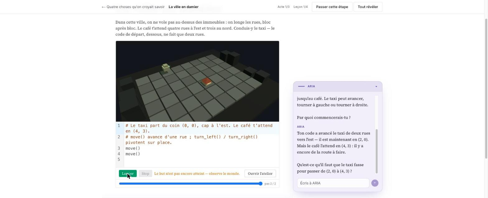
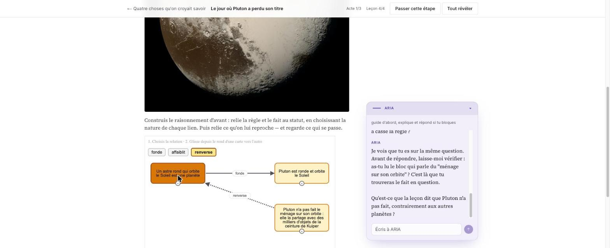

# TheTeacher

Lessons you walk through by doing, with an AI tutor that reads the state of what you built.

## → Try it: https://theteacher2.sofianehutao.workers.dev

Create an account and the demo course *Quatre choses qu'on croyait savoir* is seeded for you
immediately. Four lessons, about ten minutes. Nothing to install, no card, no waiting list.

Start with **La ville en damier** and press `Lancer` on the code that ships with it. The screenshots
below are there so you know what you are walking into; the point is the thing itself, which moves.

---

## A lesson is a runtime, not a page

Prose, a 3D world, a code editor and the tutor share one screen. You write code, the world runs it,
and the tutor answers about what actually happened.



That lesson teaches taxicab geometry. You drive a taxi across an 8×6 grid with `move()`,
`turn_left()`, `turn_right()`. The two `move()` calls it ships with leave the taxi at (2, 0) while the
café waits at (4, 3) — and ARIA picks that up on its own:

> « Ton code a avancé le taxi de deux rues vers l'est — il est maintenant en (2, 0). Mais le café
> l'attend en (4, 3) : il y a encore de la route à faire. Qu'est-ce qu'il faut que le taxi fasse pour
> passer de (2, 0) à (4, 3) ? »

The tutor is not reading your source. It holds tools over the simulation state and asks its next
question from the result. Its standing instruction is `guide d'abord, explique et répond si tu bloques`,
so it withholds the answer while you are still moving.

## Building an argument, not answering a quiz

Another block turns a claim into a graph you assemble. Pick what a link *does*, drag from one card to
another, watch the argument hold or collapse.



The rule *"a round body orbiting the Sun is a planet"* grounds the fact *"Pluto is round and orbits the
Sun"* — a solid `fonde` arrow. Then the Kuiper-belt card is linked back with `renverse`, drawn dashed,
and the rule turns orange because it no longer holds. That is the 2006 reclassification, reconstructed
instead of recited.

## Block types

| Block | What it does |
|---|---|
| `world` | Grid simulation driven by learner code |
| `scene3d` | 3D scene, orbit-controllable with the mouse |
| `graph` | Argument graph the learner assembles by drawing typed links |
| `chart` | Plots |
| `code` | Editor plus runner, with step-by-step replay of the run |
| `question` | Free-text prompt that routes the answer into the tutor conversation |

Lessons are grouped into acts and courses. A **Studio** lets you author your own.

## Architecture

Next.js on Cloudflare Workers, plus four satellite Workers rendering inside sandboxed, origin-pinned
iframes:

```
theteacher     main app, auth, ARIA, authoring
  ├── world    grid simulation
  ├── viz      2D scenes
  ├── viz3d    3D scenes
  └── runner   Skulpt — learner Python, isolated
```

Learner code runs in `runner`, not on the main origin. That worker carries its own CSP with
`'unsafe-eval'`; the main origin neither needs it nor has it.

- **Per-request CSP with a fresh nonce** and `strict-dynamic`, `frame-ancestors 'none'`,
  `form-action 'self'`, locked `base-uri`. Every relaxation is justified in a comment beside it.
- **Two-tier rate limiting** on the Cloudflare native binding, with a stricter ceiling on
  `/api/auth/*` for brute-force defense. Keys are length-bounded so a forged cookie cannot blow the budget.
- **ADR-driven.** Architectural decisions are written down before the code, and referenced from it.

Stack: TypeScript, Next.js 16.2, React 19.2, Mantine 9, BlockNote, Drizzle over PostgreSQL,
better-auth, three.js, Skulpt, Playwright, Vitest, Cloudflare Workers via OpenNext.

## Source

The application source is private. This repository is the public overview.

Built by [Sofiane Chardonnay](https://github.com/yepun01).
